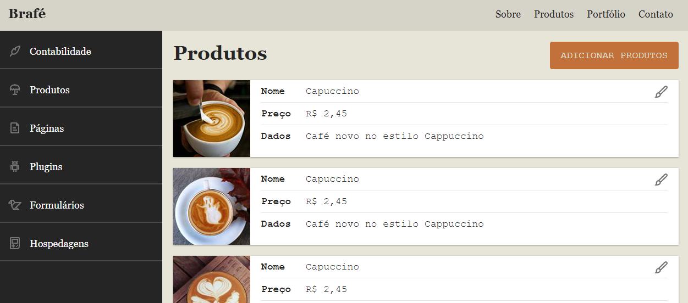

# Cafeteria Brafé V3

Este projeto tem o intuito de colocar em prática estilização CSS usando desde métricas puras até Flex Box e Grid Layout.

Este site foi desenvolvido durante os meus estudos no curso de CSS estilização da Origamid ®

 
 

## Interface

  

 
 

## Sumário

- [Tecnologias Utilizadas](#tecnologias-utilizadas)
- [Status](#status)
- [Descrição](#descrição)
- [Funcionalidades](#funcionalidades)
- [Explicação](#explicação)
- [Como Usar](#como-usar)
- [Autor](#autor)

 
 

## Tecnologias Utilizadas

  

    
  

  

    
  

 
 

## Status

<!-- -->
 
 

## Descrição

Este projeto engloba os fundamentos de como posicionar os elementos em uma página, além do uso das propriedades e como elas agem no layout do site.

## Funcionalidades

Este é um site estático, porém muito bonito e com grande imersão do usuário.

## Explicação

O projeto consiste em uma pasta img com as imagens do projeto, uma pasta css com os styles do projeto e um index.html principal da aplicação.
 
 

## Como Usar

1. git clone "caminhoDoRepositorio"
2. index.html
3. Acione a extensão Live Server
